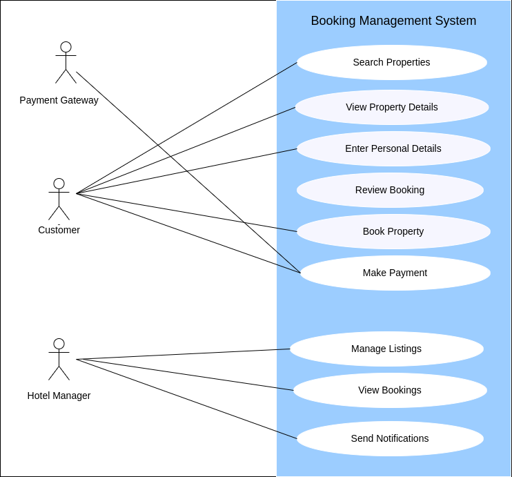

# Requirement Analysis in Software Development.
This repository is a comprehensive resource for understanding and implementing effective requirement analysis in the software development lifecycle. It includes documentation, requirement analysis techniques, and best practices for gathering, analysing, and validating software requirements. This is a critical foundation that reduces rework, ensures alignment with business objectives, and delivers solutions that truly address user needs.

## What is Requirement Analysis?
Requirement analysis is a phase in software development in which the project team gathers, analyses, and defines the requirements for the software product to be developed. This process ensures that all stakeholders have a clear and mutual understanding of what the system should do and how it should perform.

## Why is Requirement Analysis Important?
* **Clarity and Understanding:** It helps in understanding what the stakeholders expect from the software, reducing ambiguity.
* **Scope Definition:** Clearly defines the scope of the project, which helps in preventing scope creep.
* **Basis for Design and Development:** Provides a solid foundation for designing and developing the system.
* **Cost and Time Estimation:** Facilitates accurate estimation of project cost, resources, and time.
* **Quality Assurance:** Ensures that the final product meets the specified requirements, leading to higher customer satisfaction.  
  
## Key Activities in Requirement Analysis.
### 1. Requirement Gathering 
* **Interviews:** Conducting interviews with stakeholders to gather detailed information about their needs and expectations.
* **Surveys/Questionnaires:** Distributing surveys to collect requirements from a larger audience.
* **Workshops:** Organizing workshops with stakeholders to discuss and gather requirements.
* **Observation:8** Observing end-users in their working environment to understand their needs.
* **Document Analysis:** Reviewing existing documentation and systems to understand current functionalities and requirements. 

### 2. Requirement Elicitation 
* **Brainstorming:** Conducting brainstorming sessions to generate ideas and gather requirements.
* **Focus Groups:** Holding focus group discussions with selected stakeholders to gather detailed requirements.
* **Prototyping:** Creating prototypes to help stakeholders visualize the system and refine their requirements. 

### 3. Requirement Documentation
* **Requirement Specification Document:** Creating a detailed document that lists all functional and non-functional requirements.
* **User Stories:** Writing user stories to describe functionalities from the user’s perspective.
* **Use Cases:** Creating use case diagrams to show interactions between users and the system. 

### 4. Requirement Analysis and Modeling
* **Requirement Prioritization:** Prioritizing requirements based on their importance and impact on the project.
* **Feasibility Analysis:** Assessing the feasibility of requirements in terms of technical, financial, and time constraints.
* **Modeling:** Creating models (e.g., data flow diagrams, entity-relationship diagrams) to visualize and analyze requirements. 

### 5. Requirement Validation
* **Review and Approval:** Reviewing the documented requirements with stakeholders to ensure accuracy and completeness.
* **Acceptance Criteria:** Defining clear acceptance criteria for each requirement to ensure they meet the expected standards.
* **Traceability:** Establishing traceability matrices to ensure all requirements are addressed during development and testing.  

## Types of Requirements
### Functional Requirements
**Definition:** Describe what the system should do. 

#### Key Functional Requirements:
- **Search Properties:** Users should be able to search for properties based on various criteria such as location, price, and availability.  
- **User Registration:** New users should be able to create an account with personal details and login credentials.  
- **Property Listings:** Display properties with essential details and images. Managers should be able to list and manage property details.  
- **Booking System:** Users should be able to book properties, view booking details, and manage their bookings.  
- **User Authentication:** Secure login and registration process for users, with options for both customers and managers.  
- **Payment Processing:** Secure payment system integrated with third-party payment providers.  
- **Notification System:** Automatically send notifications for booking confirmations, cancellations, and special offers.  

### Non-functional Requirements
**Definition:** Describe how the system should perform.  

#### Key Non-functional Requirements:
- **Performance:** 
  - The system should load pages within 2 seconds.  
  - Must handle up to 10,000 concurrent users without downtime.  
- **Security:** 
  - Ensure data encryption, secure login, and protection against common vulnerabilities.  
  - User data must be securely stored, and sensitive information must be encrypted.  
- **Scalability:** 
  - The system should support horizontal scaling using a microservices architecture.  
  - It must be able to handle increased traffic as user demand grows.  
- **Usability:** 
  - The application should have an intuitive UI/UX, making it easy for users to navigate and perform tasks.  
  - It should be responsive across all devices (desktop, tablet, and mobile).  
- **Reliability:** 
  - The system should maintain 99.9% uptime, ensuring high availability for users.  
  - It should recover quickly from any failures (auto-recovery).  
- **Logging and Monitoring:** 
  - The system should maintain detailed logs for security, performance, and error tracking.  

## Use Case Diagrams
Use case diagrams show how different users (actors) interact with the system to achieve specific goals (use cases).

### Benefits of Use Case Diagrams:
* Provide a clear visual representation of system functionalities.
* Help in identifying and organizing system requirements.
* Facilitate communication among stakeholders and development team.

#### Use Case Diagram:

